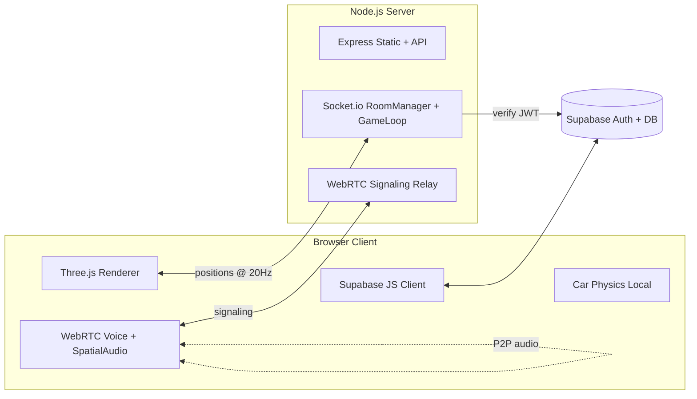

# Clutch Clash — Multiplayer Racing Game Plan

## Tech Stack (Final)
- **Frontend**: Three.js (3D), Vite (dev server/bundler), vanilla JS (ES modules), Web Audio via `THREE.PositionalAudio` (spatial sound)
- **Backend**: Node.js + Express + Socket.io (rooms, position sync, WebRTC signaling)
- **Physics**: Client-side arcade car physics (custom, simple raycast/kinematic model) — server sirf relay + race-state authority (checkpoints, finish order)
- **Voice**: WebRTC mesh (raw RTCPeerConnection, Socket.io signaling) → remote audio streams ko `PositionalAudio` me pipe karenge = proximity voice
- **Auth + Friends**: Supabase (Auth + Postgres tables: `profiles`, `friendships`)

## Architecture



## Directory Structure

```
clutch-clash/
├── package.json                  # root scripts (dev: server + client)
├── server/
│   ├── package.json
│   ├── src/
│   │   ├── index.js              # entry — Express + Socket.io bootstrap
│   │   ├── config/env.js
│   │   ├── auth/verifySupabase.js    # socket middleware (JWT verify)
│   │   ├── rooms/RoomManager.js      # Singleton — create/join/leave rooms
│   │   ├── rooms/Room.js             # per-room state, players, race status
│   │   ├── game/RaceController.js    # countdown, checkpoint validation, finish order
│   │   ├── game/tracks.js            # track metadata (shared with client)
│   │   └── sockets/                  # event handlers (lobby, race, voice-signaling)
├── client/
│   ├── package.json  (vite, three, socket.io-client, @supabase/supabase-js)
│   ├── index.html
│   └── src/
│       ├── main.js               # app bootstrap + screen router
│       ├── core/ (Engine.js, AssetLoader.js, Input.js)
│       ├── game/ (CarFactory.js, CarPhysics.js, TrackBuilder.js, CheckpointSystem.js, RemotePlayers.js)
│       ├── tracks/ (trackDefinitions.js — 3/5/10 checkpoint maps)
│       ├── net/ (SocketClient.js — Singleton, StateSync.js — interpolation)
│       ├── voice/ (VoiceManager.js, SpatialAudio.js)
│       ├── auth/ (supabaseClient.js, authService.js, friendsService.js)
│       └── ui/ (screens: Login, MainMenu, MapSelect, Lobby, HUD, Results)
```

## Design Patterns
- **Singleton**: `RoomManager`, `SocketClient`, Supabase client — ek hi instance sab jagah
- **Factory**: `CarFactory` (car meshes/colors banane ke liye), `TrackBuilder` (track definition JSON → 3D mesh)
- **Observer/EventEmitter**: game events (checkpoint crossed, race finished) UI aur network ko decouple karte hain
- **Data-driven tracks**: tracks = JSON definitions (spline points + checkpoint positions), naya map add karna = sirf ek JSON file

## Implementation Phases

### Phase 1 — Project Setup + 3D Core
Monorepo setup (server + client), Vite + Three.js scene, ground, lighting, chase camera, ek basic F1-style low-poly car (box/cylinder meshes se — koi external model nahi chahiye), keyboard driving with arcade physics (acceleration, steering, drift friction).

### Phase 2 — Tracks + Checkpoint System
`TrackBuilder`: Catmull-Rom spline se track road mesh generate, barriers, start/finish line. 3 track definitions: Sprint Circuit (3 checkpoints), Grand Loop (5 checkpoints), Endurance Ring (10 checkpoints). Checkpoint = invisible trigger gates; car off-track/reset (R key) → last checkpoint pe respawn. Map select screen.

### Phase 3 — Multiplayer Rooms (Socket.io)
Room create → 6-char room code milega, doosre device se join. Server: `RoomManager` + per-room player list. Position/rotation/velocity broadcast @20Hz (binary-lean payload), client-side interpolation for smooth remote cars. Lobby screen with player list + host "Start Race" button.

### Phase 4 — Race Logic
Server-side `RaceController`: 3-2-1 countdown sync, checkpoint order validation (server authoritative — skip nahi kar sakte), lap counting, finish order, results screen with timings.

### Phase 5 — Voice Chat + Spatial Audio
Socket.io se WebRTC signaling (offer/answer/ICE), room ke sab players ke beech P2P mesh. Remote audio stream → `THREE.PositionalAudio` attached to that player's car = paas wali car ki aawaz tez, door wali dheemi. Engine sounds bhi positional (Web Audio oscillator-based, koi audio file ki zaroorat nahi). Mute toggle.

### Phase 6 — Supabase Auth + Friends
Email/password + guest mode. `profiles` table (username), `friendships` table (requests/accepted). Friend search by username, add/accept, friends list in menu. Socket connections Supabase JWT se verify honge.

## Aapko kya provide karna hoga (sirf Phase 6 pe chahiye)
1. [supabase.com](https://supabase.com) pe free account → new project banao
2. Project **URL** aur **anon public key** (Settings → API me milta hai) mujhe de dena
3. Main SQL schema de dunga jo aap Supabase SQL editor me paste karoge

Phases 1–5 bina kisi external cheez ke chal jayenge — bas Node.js installed hona chahiye (jo hai). Testing ke liye: server LAN pe expose karenge taaki aap phone/dusre laptop se same WiFi pe join karke race test kar sako. (Note: voice chat ke liye mic access HTTPS ya localhost pe hi milta hai — LAN testing ke liye main ek self-signed cert ya `--host` workaround setup kar dunga.)

## Optimization Considerations
- Network: sirf changed state bhejni, 20Hz tick, snapshot interpolation client pe
- Three.js: geometry/material reuse (ek hi car geometry sab players ke liye), object pooling, dispose on scene exit
- Voice: P2P mesh 6-8 players tak theek hai (room size cap rakhenge)